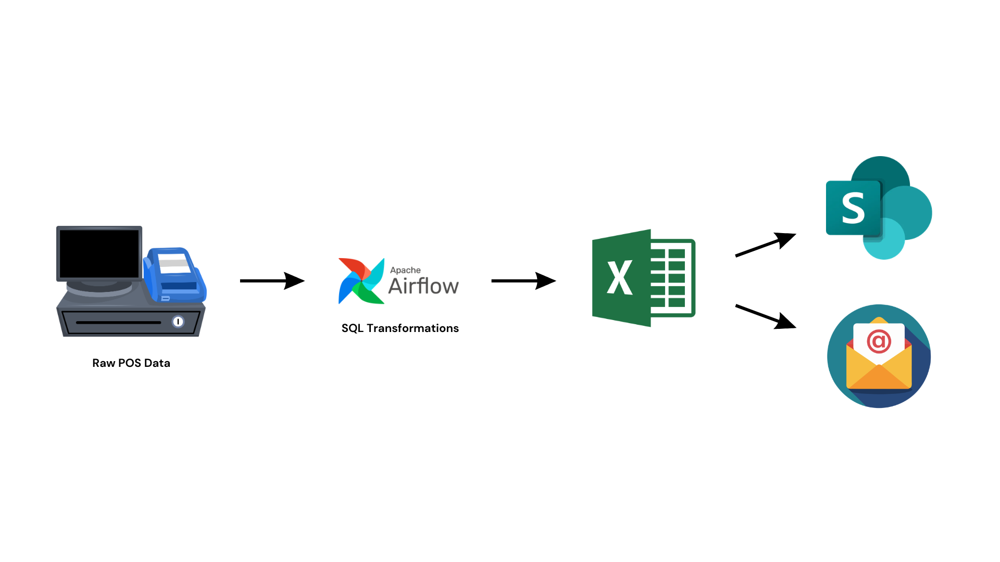
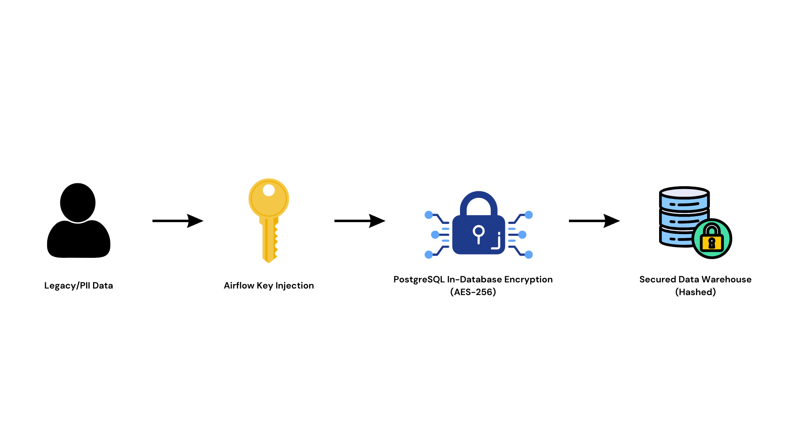
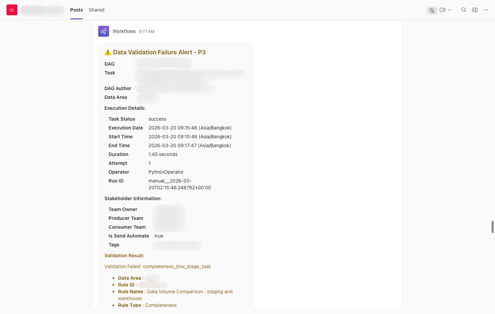
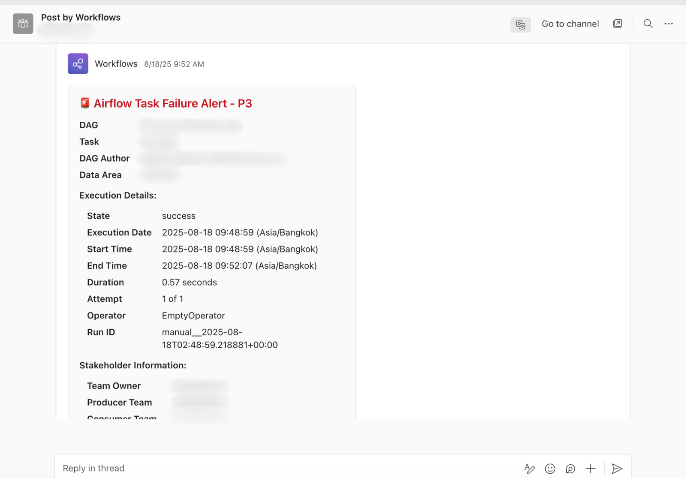

# Hi, I'm Paepilai! 👋
**Part-Time Data Engineer | Full-Time Learner | Pro-Walker | Deep Talk Seeker**

I am a Data Engineer passionate about transforming manual, time-consuming workflows into high-performance, automated data systems. Currently balancing my IT degree at KMUTT with my role as a Part-Time Data Engineer, where my day-to-day work revolves around building scalable ETL/ELT pipelines, architecting data quality frameworks, and creating dynamic business dashboards.

> 🔒 **PDPA & Confidentiality Notice:**
> *To comply with Thailand's Personal Data Protection Act (PDPA) and strict enterprise confidentiality agreements, the source code, specific business logic, and datasets for the enterprise projects listed below cannot be shared publicly. The descriptions serve to demonstrate the system architecture, tools utilized, and the engineering challenges solved.*
> *⚠️ **Note on Code Snippets:** Any code snippets provided below have been heavily anonymized. They utilize **mock data, abstracted schema names, and dummy variables** (no real enterprise data, names, or proprietary logic are shown). They are included solely to demonstrate my coding style, architectural patterns, and technical proficiency.*

---

## 🚀 Part-Time Data Engineer Projects

### 1. Enterprise POS Automated Reporting & Distribution System
**Overview**
This project demonstrates the automation of complex data reporting and distribution for enterprise Point of Sale (POS) systems. It replaces manual Excel reporting with a fully orchestrated workflow combining Apache Airflow for data transformation and SharePoint API & Power Automate for final delivery.

 

**Project Components**
* **Data Processing:** Complex SQL queries to extract and transform pre-curated POS data.
* **Data Formatting:** Dynamic formatting of data into standardized Excel templates.
* **Data Distribution:** Automated file delivery to enterprise directories via the SharePoint API, paired with an event-driven Power Automate workflow that sends notification emails and access links to stakeholders.

**Tools & Technologies**
* **Python & SQL:** Core logic for heavy data transformation, query execution, and template formatting.
* **Apache Airflow:** Orchestrates the scheduling, execution, and SharePoint API uploads.
* **SharePoint API:** Automates file placement into specific enterprise directories.
* **Power Automate:** Triggers automated email alerts containing direct SharePoint links to business users once files are successfully placed.

**Key Features**
* **Advanced Data Extraction:** Utilized complex SQL logic to pull exact reporting metrics from vast curated datasets.
* **Decoupled Delivery & Notification:** Handled the heavy lifting of file storage via Airflow and the SharePoint API, while leveraging Power Automate to deliver clean, link-embedded email notifications to stakeholders, completely eliminating manual export tasks.
  
**Learnings & Skills**
* **API Integration:** Learned to seamlessly integrate data pipelines with enterprise file-sharing systems (SharePoint).
* **Business Logic Implementation:** Translated complex POS reporting requirements into automated SQL/Python scripts.

<details>
<summary><b>💻 Click to expand Code Snippet: Advanced Time-Series Aggregation & Ranking</b></summary>

* **Advanced Data Warehousing: Time-Series Comparison & Dynamic Ranking**
  This query extracts transactional data and calculates multi-period 
  sales comparisons (Current Period, Previous Period) in a single pass.
  It utilizes GROUPING SETS for multi-level hierarchical totals and 
  Window Functions for dynamic partitioning and ranking.
*/
```sql
WITH Aggregated_Metrics AS (
    SELECT
        COALESCE(dp.product_group, 'Uncategorized') AS prod_group,
        COALESCE(dp.product_id, 'UNKNOWN') AS prod_id,
        COALESCE(dp.product_desc, 'No Description') AS prod_desc,
        COALESCE(dp.manufacturer_id, 'N/A') AS mfg_id,

        -- Identify grouping levels for multi-tier aggregations
        GROUPING(dp.product_group) AS is_group_total,
        GROUPING(dp.product_id) AS is_product_total,

        -- [CURRENT PERIOD] Conditional Aggregation for Volume & Revenue
        SUM(CASE 
            WHEN fo.order_timestamp >= date_trunc('month', '{report_date}'::date) 
            AND fo.order_timestamp < '{report_date}'::date + 1 
            THEN fsl.quantity * COALESCE(fo.conversion_multiplier, 1) ELSE 0 
        END) AS curr_period_vol,
        
        SUM(CASE 
            WHEN fo.order_timestamp >= date_trunc('month', '{report_date}'::date) 
            AND fo.order_timestamp < '{report_date}'::date + 1 
            THEN fsl.revenue_base * COALESCE(fo.conversion_multiplier, 1) ELSE 0 
        END) AS curr_period_rev,

        -- [PREVIOUS PERIOD] Dynamic Date Intervals
        SUM(CASE 
            WHEN fo.order_timestamp >= date_trunc('month', '{report_date}'::date - interval '1 month') 
            AND fo.order_timestamp < date_trunc('month', '{report_date}'::date) 
            THEN fsl.revenue_base * COALESCE(fo.conversion_multiplier, 1) ELSE 0 
        END) AS prev_period_rev

    FROM enterprise_dwh.fact_sales_line_items fsl 
    LEFT JOIN enterprise_dwh.fact_orders fo 
        ON fsl.order_key = fo.order_key
    LEFT JOIN enterprise_dwh.dim_product dp 
        ON fsl.product_key = dp.product_key 

    WHERE fo.order_timestamp >= date_trunc('month', '{report_date}'::date - interval '3 month') 
      AND fo.order_timestamp < '{report_date}'::date + 1
      AND fo.order_status NOT IN ('Pending', 'Cancelled') 
      AND fsl.invoice_id IS NOT NULL 

    -- Calculate granular details alongside Group Totals and Grand Totals
    GROUP BY GROUPING SETS (
        (dp.product_group, dp.product_id, dp.product_desc, dp.manufacturer_id),
        (dp.product_group),
        ()
    )
)

SELECT
    CASE WHEN is_group_total = 1 THEN 'Grand Total' ELSE prod_group END AS "Product Group",
    
    -- Dynamic Ranking: Rank items within their specific group based on Revenue
    CASE 
        WHEN is_product_total = 1 OR COALESCE(curr_period_rev, 0) = 0 THEN NULL 
        ELSE RANK() OVER (PARTITION BY is_product_total ORDER BY curr_period_rev DESC NULLS LAST) 
    END AS "Group Rank",
    
    CASE 
        WHEN is_group_total = 1 THEN NULL 
        WHEN is_product_total = 1 THEN 'Total' 
        ELSE prod_id 
    END AS "Product ID",
    
    CASE WHEN is_product_total = 1 THEN NULL ELSE prod_desc END AS "Product Description",

    ROUND(curr_period_vol, 2) AS "Volume Sold",
    ROUND(curr_period_rev, 2) AS "Base Revenue",
    ROUND(curr_period_rev / NULLIF(curr_period_vol, 0), 2) AS "Average Unit Price",

    ROUND(prev_period_rev, 2) AS "Previous Period Revenue",
    ROUND(prev_period_rev - curr_period_rev, 2) AS "Period Variance"

FROM Aggregated_Metrics

ORDER BY 
    is_group_total ASC,
    CASE WHEN prod_group = 'Uncategorized' THEN 1 ELSE 0 END ASC,
    prod_group ASC,
    is_product_total ASC,
    curr_period_rev DESC NULLS LAST;
```
</details>

<details>
<summary><b>💻 Click to expand Code Snippet: Dynamic Airflow Orchestration & Task Mapping</b></summary>

* **Enterprise Airflow DAG: Dynamic Task Generation & Fan-In/Fan-Out Workflow**
  This snippet demonstrates a highly scalable orchestration pattern. 
  Instead of hardcoding tasks, it dynamically generates SQL execution 
  tasks based on configuration files, processes them in parallel 
  within a TaskGroup, and uses a Fan-In pattern to compile the final report.

  ```python
  from typing import Any, Dict, List
  import logging
  from pathlib import Path
  from pendulum import datetime
  from airflow.decorators import dag, task, task_group
  from airflow.models.dagrun import DagRun
  from airflow.models.variable import Variable
  from airflow.utils.task_group import TaskGroup
  import re
  
  logger = logging.getLogger("airflow.task")
  
  # --- Enterprise DAG Configurations ---
  DAG_OWNER = "DataEngineering_Team"
  DAG_ID = "enterprise_automated_reporting_pipeline"
  SCHEDULE = "0 8 * * *"  
  TIMEZONE = "UTC"
  TAGS = ["domain:sales_reporting", "automation", "api_integration"]
  CONN_ID = "enterprise_dwh_prod" 
  
  DEFAULT_ARGS = {
      "owner": DAG_OWNER,   
      "email_on_failure": False,
      "retries": 1,
  }
  
  @dag(
      dag_id=DAG_ID,
      default_args=DEFAULT_ARGS,
      schedule_interval=SCHEDULE,
      start_date=datetime(2024, 1, 1, tz=TIMEZONE),
      catchup=False,
      tags=TAGS,
  )
  def automated_reporting_pipeline():
      
      # 1. Initialization Task
      @task
      def init_pipeline(**kwargs):
          logger.info("Initializing automated reporting configurations...")
          # Fetching dynamic configurations from Airflow Variables
          return Variable.get("reporting_pipeline_config", deserialize_json=True)
  
      # 2. Dynamic Task Group for Parallel Execution
      @task_group(group_id='process_regional_reports')
      def process_reports(pipeline_config: Dict[str, Any]):
          
          extracted_data_list = []
          
          # FAN-OUT: Dynamically generate a task for every SQL query in the config
          for sql_key, sql_file in pipeline_config.get('sql_mappings', {}).items():
              
              # Sanitize task IDs for Airflow compliance
              safe_task_id = f"execute_sql_{re.sub(r'[^a-zA-Z0-9_.-]', '_', sql_key)}"
              
              # Trigger the fetch task safely using .override() to assign the dynamic ID
              execute_op = execute_sql_data_task.override(task_id=safe_task_id)(
                  sql_key=sql_key, 
                  sql_file=sql_file, 
                  conn_id=CONN_ID, 
                  execution_date_str="{{ ds }}"
              )
              
              # Append the output reference to our list for the Fan-In downstream
              extracted_data_list.append(execute_op)
  
          # FAN-IN: Compile the report ONLY after all parallel SQL fetches succeed
          compile_op = compile_report_task(
              all_extracted_data=extracted_data_list,
              execution_date_str="{{ ds }}"
          )
          
          # API Integration & Cleanup Downstream
          upload_op = upload_to_enterprise_sharepoint(compile_op)
          cleanup_op = cleanup_temp_files(upload_op)
  
          compile_op >> upload_op >> cleanup_op
  
      config_data = init_pipeline()
      process_reports(config_data)
  
  dag_instance = automated_reporting_pipeline()
  ```
</details>

---

### 2. Secure Enterprise Pipeline & On-Premise Synchronization
**Overview**
Designed to handle highly sensitive data, this project involves building a secure ETL pipeline that routes data across DEV, QA, and Production environments while enforcing strict PII (Personally Identifiable Information) encryption on on-premise databases.

 

**Project Components**
* **Data Ingestion:** Airbyte Connections.
* **Data Security:** SHA-256 Hashing and Encryption layer.
* **Data Storage:** On-Premise Database.

**Tools & Technologies**
* **Airbyte:** Open-source data integration tool for ELT processes.
* **SQL:** For defining schema structures and executing data merges/inserts/upserts.
* **GitLab & Jenkins:** Used for version control, code review, and CI/CD deployment to all environments (DEV/QA/PROD).

**Key Features**
* **PII Protection:** Implemented robust hashing and encryption logic for sensitive data before it reaches the on-premise storage.
* **Multi-Environment Deployment:** Managed data flow across Development, QA, and Production environments securely.

**Learnings & Skills**
* **Data Privacy Compliance:** Mastered the handling of sensitive PII data within strict enterprise environments.
* **CI/CD Workflows:** Gained hands-on experience deploying complex DAGs and SQL scripts using Jenkins.
  
---

### 3. Automated Data Quality Framework & Serverless Alerting System
**Overview**
Architected a comprehensive data quality framework from scratch to ensure the integrity of a major digital voucher data warehouse. To support this, I overhauled the standard Apache Airflow alerting mechanism by integrating Power Automate and MS Teams Webhooks, providing real-time, detailed pipeline status and data quality alerts without relying on premium API connectors.

 
 

**Project Components**
* **Data Modeling & Quality Rules:** Schema definition and SQL scripts testing 6 dimensions of data quality.
* **Orchestration & Trigger Events:** Airflow DAGs managing validation dependencies and evaluating custom task states via XComs.
* **Workflow Automation & Notification System:** Power Automate HTTP Webhooks pushing dynamic MS Teams Adaptive Cards based on validation results.
  
**Tools & Technologies**
* **Apache Airflow:** Workflow orchestrator for scheduling and dependency management.
* **SQL:** Core engine for executing the 6-dimensional validation logic.
* **Power Automate & MS Teams Webhooks:** Low-code workflow automation and real-time messaging integration for alert distribution.
* **GitLab & Jenkins:** Used for version control, code review, and CI/CD deployment across all environments (DEV/QA/PROD).

**Key Features**
* **Six-Dimensional Checking:** Automated checks for Completeness, Consistency, Validity, Uniqueness, Accuracy, and Freshness.
* **"Silent Failure" Detection (Granular Alerting):** Configured alerts to trigger not just on system crashes, but specifically when a task succeeds technically but the underlying data fails internal business logic validations.
* **SDLC Standardized Testing:** Developed comprehensive Unit Testing documentation and test cases aligning with standard Software Development Life Cycles.
* **Cost-Efficient Architecture:** Bypassed premium MS Teams connectors by configuring custom HTTP URL triggers via Power Automate.
  
<details>
<summary><b>💻 Click to expand Code Snippet: Custom Business Logic Notifier (Python/Airflow)</b></summary>

* **Custom Airflow Notifier: Business Logic Alerting**
  This Python class extends Airflow's BaseNotifier to send Adaptive Cards 
  to Microsoft Teams. 
  The true value is in the `notify` method: instead of relying on standard 
  system crashes, it pulls XCom data to detect "Silent Failures" — where 
  the SQL executed successfully, but the resulting data failed validation rules.
  
```python
import logging
import requests
from airflow.models import Variable
from airflow.notifications.basenotifier import BaseNotifier
from airflow.utils.context import Context

logger = logging.getLogger(__name__)

class EnterpriseTeamsNotifier(BaseNotifier):
    """
    Custom Airflow Notifier designed to catch Data Quality failures 
    and push real-time alerts to Microsoft Teams.
    """

    def __init__(self, data_area: str, consumer_team: str):
        super().__init__()
        self.data_area = data_area
        self.consumer_team = consumer_team

    def notify(self, context: Context) -> None:
        """
        Evaluate XCom results to determine if a technically successful 
        task actually failed its data validation checks.
        """
        ti = context["task_instance"]

        # 1. Skip standard system failures (handled by default operators)
        if ti.state != "success":
            return
        
        try:
            # 2. Extract the business validation payload from Airflow XCom
            task_result = ti.xcom_pull(task_ids=ti.task_id)
            
            # 3. Trigger alert ONLY if business logic validation explicitly failed
            if isinstance(task_result, dict) and task_result.get("status") == "failed":
                logger.info("System execution passed, but Data Validation FAILED. Sending alert.")
                
                payload = self._create_adaptive_card(context)
                self._send_webhook(payload)
                
            else:
                logger.info("Task and Data Validations succeeded. No alert required.")
                
        except Exception as e:
            logger.error(f"Error evaluating validation result for MS Teams alert: {str(e)}")
            raise

    def _send_webhook(self, payload: dict) -> None:
        """Securely post the Adaptive Card to the enterprise Webhook."""
        webhook_url = Variable.get("enterprise_msteams_webhook_url")
        
        try:
            response = requests.post(webhook_url, json=payload, timeout=10)
            response.raise_for_status()
            logger.info(f"Teams notification sent successfully (status code: {response.status_code})")
            
        except requests.exceptions.RequestException as e:
            logger.error(f"Failed to send Teams notification: {e}")
            raise
```
</details>

---

## 🌟 Data Engineer Intern Projects

### 4. Enterprise PII Data Security & Hashing Framework
**Overview**
A critical security infrastructure project aimed at fortifying data privacy compliance across multiple enterprise domains (Customer Profiles, Visitor Logs, Digital Gift Cards). The solution involved developing advanced cryptographic logic to protect sensitive customer data.

**Project Components**
* **Cryptographic Layer:** AES Encryption and SHA-256 Hashing.
* **Query Optimization:** Common Table Expressions (CTEs).
* **Data Integration:** Merge SQL Files.

**Tools & Technologies**
* **Python (PyCryptodome):** Utilized for robust encryption and hashing algorithms.
* **PostgreSQL (Cloud DWS):** Relational database management.
* **GitLab & Jenkins:** Used for version control, code review, and CI/CD deployment to all environments (DEV/QA/PROD).

**Key Features**
* **Irreversible Hashing:** Added dedicated hash columns for emails and phone numbers to allow data analysis without exposing raw PII.
* **Optimized Decryption:** Refactored legacy encryption logic by moving decryption processes into SQL CTEs, drastically reducing redundant calculations and query execution time.

<details>
<summary><b>💻 Click to expand Code Snippet: In-Database PII Cryptography & Key Injection**</b></summary>

* **Enterprise Data Security: PII Encryption & Hashing Framework**
  This snippet demonstrates secure in-database data transformation. 
  It handles the decryption of legacy data and re-encrypts it using 
  AES-256 (CBC mode) and SHA-256. Cryptographic keys are securely 
  injected at runtime via Airflow template parameters to ensure 
  Zero-Trust architecture (keys are never hardcoded).

  ```sql
  WITH Secure_PII_Transformation AS (
      SELECT
          user_uuid,
          created_timestamp,
          created_by_system,
          identity_type,
  
          -- 1. Complex Re-Encryption: Safely handle empty byte arrays ('\x'), 
          -- decrypt legacy data, and re-encrypt using central AES-256 functions.
          CASE 
              WHEN government_id = '\x' THEN NULL 
              ELSE 
                  enterprise_core_encrypt(
                      legacy_pgp_decrypt(government_id::bytea, '{{ params.legacy_decryption_key }}'),
                      '{{ params.master_encryption_key }}', 
                      'aes256', 
                      'cbc', 
                      'sha256'
                  ) 
          END AS encrypted_gov_id,
  
          CASE 
              WHEN primary_phone = '\x' THEN NULL 
              ELSE 
                  enterprise_core_encrypt(
                      legacy_pgp_decrypt(primary_phone::bytea, '{{ params.legacy_decryption_key }}'),
                      '{{ params.master_encryption_key }}', 
                      'aes256', 
                      'cbc', 
                      'sha256'
                  ) 
          END AS encrypted_phone,
  
          -- 2. Standard Enterprise Encryption: Utilizing the centralized wrapper 
          -- function combined with Airflow Global Variables.
          enterprise_custom_encrypt(
              identity_number, 
              '{{ var.value.tenant_standard_encryption_key }}'
          ) AS secured_identity_number
  
      FROM raw_landing.user_profiles
      WHERE user_status = 'ACTIVE'
  )
  
  SELECT 
      user_uuid,
      identity_type,
      encrypted_gov_id,
      encrypted_phone,
      secured_identity_number,
      created_timestamp
  FROM Secure_PII_Transformation;
    ```
</details>

---

### 5. Global Retail Visitor Analytics Dashboard
**Overview**
Developed a comprehensive Business Intelligence solution to track user engagement and campaign performance. The dashboard integrates data from physical registration kiosks and digital voucher systems to provide actionable insights for the Business Teams.

**Project Components**
* **Data Sources:** Visitor Registrations and Digital Voucher Databases.
* **Data Processing:** Dynamic SQL and Jinja Templating.
* **Visualization:** Interactive BI Dashboards.

**Tools & Technologies**
* **Apache Superset:** Open-source data exploration and visualization platform.
* **Miro:** Used for UI/UX dashboard wireframing and flow mapping.

**Key Features**
* **Advanced Visualizations:** Implemented Sunburst charts for acquisition channels, Funnel charts for user journeys, and Word Clouds for demographics.
* **Dynamic Querying:** Utilized Jinja templates within SQL to create highly flexible and interactive dashboard filters.

---

### 6. Enterprise Tenant Management Pipeline Refactoring
**Overview**
Modernized legacy data pipelines for a retail tenant management system to align with new engineering standards. Addressed missing DAG issues by optimizing variables and resolving critical system timeouts.

**Key Features**
* **Pipeline Optimization:** Refactored Airflow DAGs to utilize Dynamic Task Mapping, reducing pipeline complexity.
* **Performance Enhancements:** Prevented system timeouts and reduced Airflow overload by limiting redundant SQL executions and implementing best practices.
* **GitLab & Jenkins:** Used for version control, code review, and CI/CD deployment to all environments (DEV/QA/PROD).

<details>
<summary><b>💻 Click to expand Code Snippet: Metadata-Driven Orchestration & Dynamic TaskGroups</b></summary>

* **Modern Airflow Orchestration: Metadata-Driven ELT Pipeline**
  This snippet demonstrates an advanced Airflow 2.x orchestration pattern. 
  Instead of hardcoding tasks for each database table, it uses a @task_group 
  to dynamically generate the entire ELT lifecycle (External -> Staging -> 
  UPSERT -> Clean) based on an injected metadata configuration. 
  It also utilizes Airflow Datasets (data-aware scheduling) to automatically 
  trigger downstream dependencies the moment the UPSERT completes.

```python
import logging
from typing import Any, Dict
from airflow.decorators import dag, task_group
from airflow.providers.common.sql.operators.sql import SQLExecuteQueryOperator
from airflow.models.baseoperator import chain
from airflow.datasets import Dataset

logger = logging.getLogger("airflow.task")

@task_group(group_id="dynamic_staging_to_warehouse")
def staging_to_warehouse(conf: Dict[str, Any]) -> None:
    """
    Dynamically generates the ELT workflow for every table defined 
    in the enterprise configuration dictionary.
    """
    
    # Iterate through the metadata configuration to build tasks dynamically
    for table_key, table_config in conf.get("tables", {}).items():
        table_name = table_config.get("target_table")
        
        # 1. Define Data-Aware Scheduling Trigger (Airflow Datasets)
        # This automatically alerts downstream DAGs that fresh data is ready
        dataset_outlet = Dataset(
            f"obs://enterprise-datalake-prod/curated_zone/{table_name}",
            extra={"domain": "enterprise_tenant", "producer": "DataPlatform"}
        )

        # 2. Build the ELT task chain for the specific table
        create_external_table = SQLExecuteQueryOperator(
            task_id=f"create_ext_{table_name}",
            conn_id="enterprise_dwh_prod",
            sql=f"{table_key}/create_ext.sql",
            params={"schema": conf.get("landing_schema")}
        )

        load_to_staging = SQLExecuteQueryOperator(
            task_id=f"load_stg_{table_name}",
            conn_id="enterprise_dwh_prod",
            sql=f"{table_key}/insert_stg.sql",
            params={
                "landing_schema": conf.get("landing_schema"),
                "staging_schema": conf.get("staging_schema")
            }
        )

        # 3. UPSERT Target Table and Trigger Downstream Dataset
        upsert_to_target = SQLExecuteQueryOperator(
            task_id=f"upsert_{table_name}",
            conn_id="enterprise_dwh_prod",
            sql=f"{table_key}/upsert.sql",
            params={
                "staging_schema": conf.get("staging_schema"),
                "target_schema": conf.get("target_schema")
            },
            outlets=[dataset_outlet]  # Data-aware scheduling applied here
        )

        clean_staging = SQLExecuteQueryOperator(
            task_id=f"clean_stg_{table_name}",
            conn_id="enterprise_dwh_prod",
            sql=f"{table_key}/truncate_stg.sql",
            params={"staging_schema": conf.get("staging_schema")}
        )

        # 4. Chain the dynamically generated tasks
        chain(
            create_external_table, 
            load_to_staging, 
            upsert_to_target, 
            clean_staging
        )

    logger.info("Successfully generated dynamic ELT task group.")
```
</details>

---

### 7. Enterprise Mobile App Historical Data Processing
**Overview**
Engineered the ingestion of massive historical application data. Utilized Python and pandas to clean, transform, and map messy CSV files into the Production Data Warehouse.

**Key Features**
* **Data Transformation:** Handled nulls, extracted regex patterns, formatted timestamps, and fixed broken JSON strings via custom Python scripts.
* **Seamless Ingestion:** Successfully mapped and imported the cleaned data into the DWS Production environment, enabling historical trend analysis for the Data Science team.
